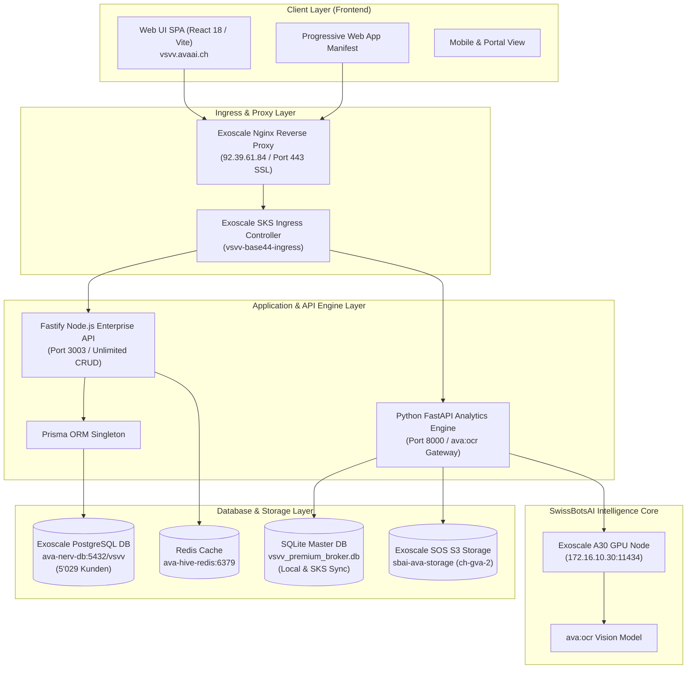
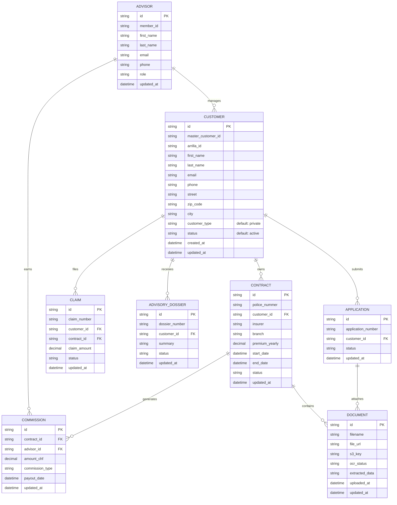
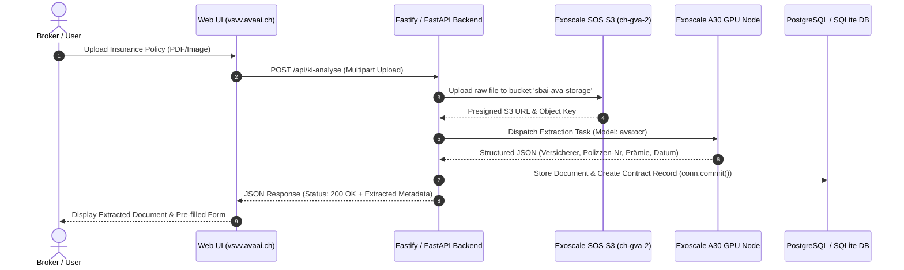
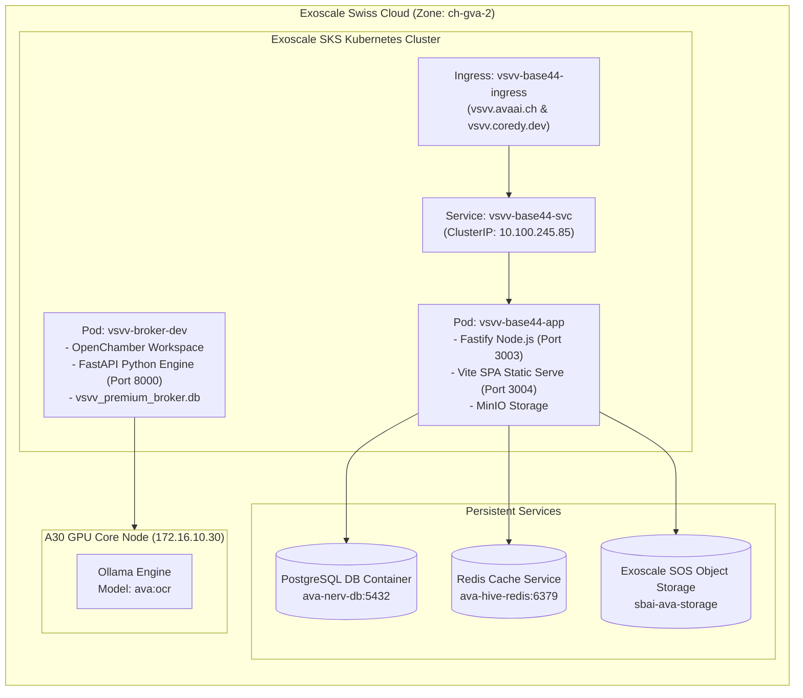

# 🇨🇭 VSVV Premium Broker System — Master Architecture & Technical Documentation

**System Name:** VSVV Premium Broker Enterprise System  
**System Identity:** Cody.Nucl3us (SwissBotsAI Ökosystem)  
**Operator:** Nik Istrefi (Founder, SwissBotsAI)  
**Live Target Web UI:** `https://vsvv.avaai.ch`  
**Live Backend API Engine:** `http://localhost:8000` / Exoscale SKS Pod `vsvv-base44-app` (Fastify 3003)  
**Infrastructure Target:** Exoscale SKS Kubernetes Cluster & Exoscale GPU Node (`ch-gva-2`)  
**Data Volume:** 5'029 Master Customers, 110 Contracts, 961 Advisors, CHF 323'073.45 Premium Volume  
**OCR AI Engine Model:** `ava:ocr`  

---

## 1. High-Level System Architecture



---

## 2. Entity-Relationship Data Model (ERD)



---

## 3. Intelligent OCR Document Pipeline (`ava:ocr`)



---

## 4. Exoscale SKS Kubernetes Deployment Infrastructure



---

## 5. REST API Endpoint Specification

### Core Endpoints Table

| Method | Endpoint Route | Description | Auth Required | Default Limit |
| :--- | :--- | :--- | :--- | :--- |
| `POST` | `/api/auth/login` | Authenticate user & return Bearer JWT | No | N/A |
| `GET` | `/api/stats` | Return live dashboard summary counts | Yes | N/A |
| `GET` | `/api/customers` | Query master customer list (5'029 records) | Yes | **5'000 (Unlimited)** |
| `POST` | `/api/customers` | Create new master customer record | Yes | N/A |
| `PATCH` | `/api/customers/:id` | Update customer record (commit to DB) | Yes | N/A |
| `GET` | `/api/contracts` | List all insurance contracts | Yes | 5'000 |
| `GET` | `/api/advisors` | List all 961 VSVV advisors & partners | Yes | 5'000 |
| `POST` | `/api/ki-analyse` | Trigger OCR extraction with `ava:ocr` model | Yes | N/A |
| `GET` | `/api/documents` | List uploaded policy documents with S3 links | Yes | 5'000 |

---

## 6. RBAC & Security Specification

| Role | Access Level | Capabilities |
| :--- | :--- | :--- |
| **Administrator** | Full Access (`*`) | Full CRUD across all 29 pages, user management, audit logs, system checks, database exports. |
| **Advisor / Broker** | Manager Access | Read/Write assigned customers, contracts, quotes, commissions, dossiers. |
| **Partner** | Restricted Read | Read-only access to relevant client contracts and commission statements. |
| **Client (Portal)** | Portal Access | Self-service portal view for personal insurance policies and claims. |

---

## 7. Operational Runbook & Maintenance Commands

### SKS Pod Deployment & Restart
```bash
# Connect via SSH to GPU Host / SKS Management Node
ssh sbai-gpu

# Check pod statuses
kubectl get pods -l app=vsvv-base44-app

# Execute clean rollout restart
kubectl rollout restart deployment vsvv-base44-app
kubectl rollout status deployment vsvv-base44-app
```

### Database Persistence & Backup
```bash
# Check PostgreSQL live customer count inside pod
kubectl exec vsvv-base44-app-6bd4d6dc69-2kbrx -c app -- node /tmp/count_pg.js

# Backup SQLite database
cp vsvv_premium_broker.db vsvv_premium_broker_backup_$(date +%Y%m%d).db
```

---
*Documentation generated by Cody.Nucl3us — SwissBotsAI Enterprise Intelligence.*
